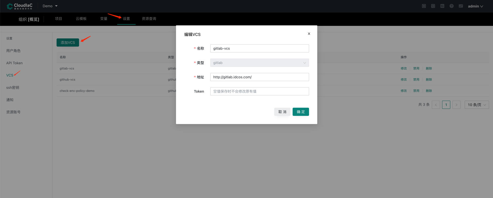
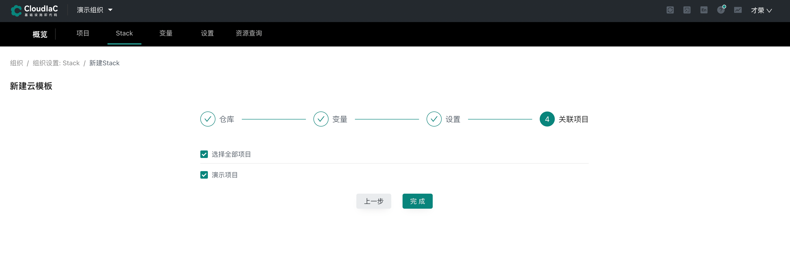
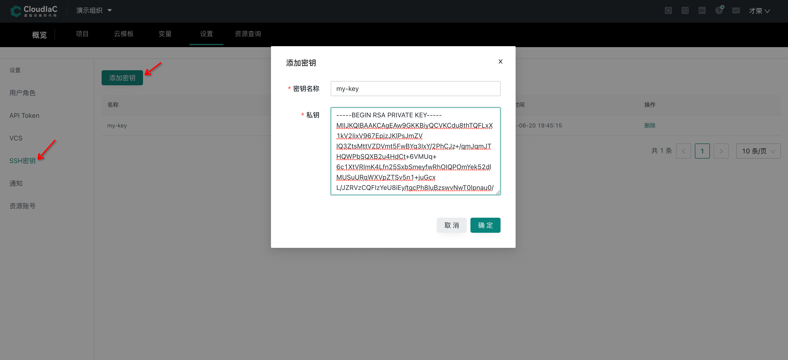
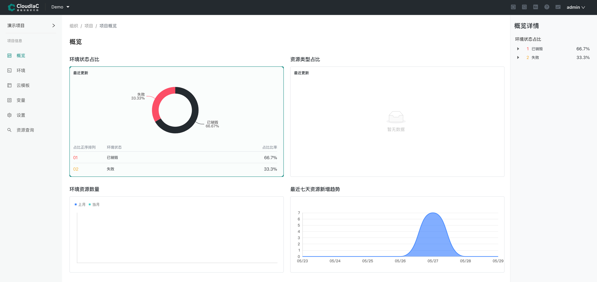
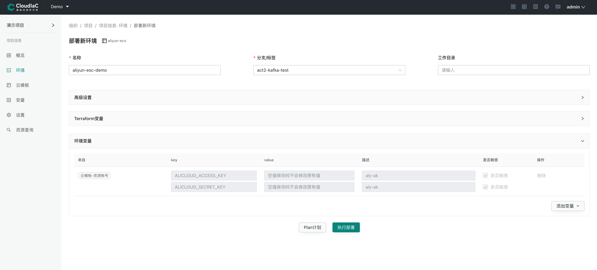
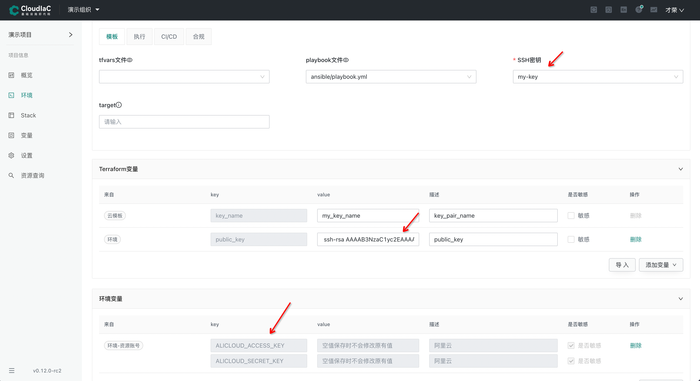
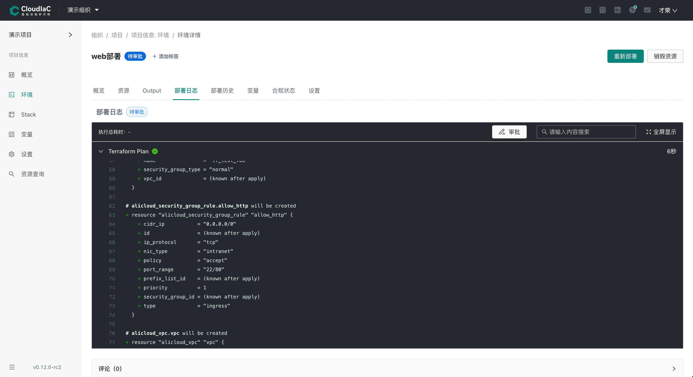
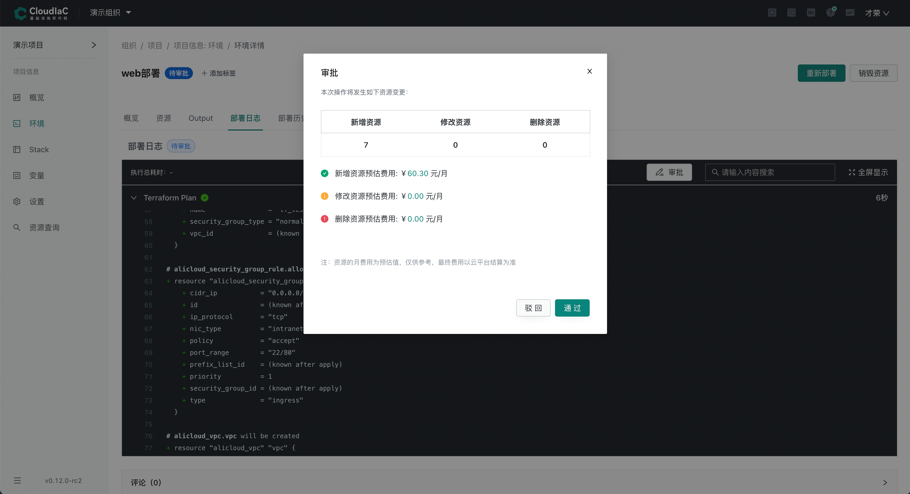
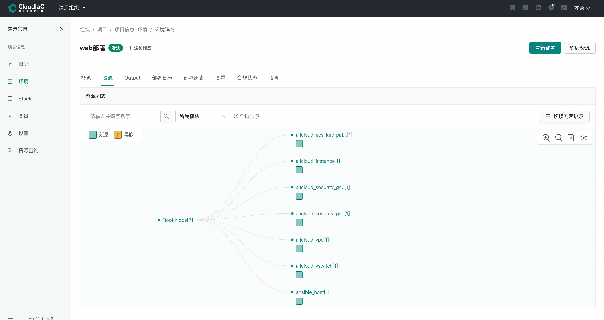

# 环境即服务
:::tip
CloudIaC 提出了『环境即服务』的管理理念，即通过一体化环境交付来响应用户请求，此处的环境代表若干基础设施以及部署运行于其上的应用的组合，一个环境由一个 Stack 来定义
:::

## 场景
以下用一个简单的资源 + 应用场景来举例说明什么是『环境即服务』

申请一台阿里云 ECS，开放 80 端口，并在其上部署 nginx 服务

### 编写 Stack
Stack 定义了一个环境所需的基础设施和需要部署的应用，所以我们首先要把 Stack 定义出来

[示例仓库链接](https://github.com/licairong/alicloud-ecs-web)

Stack 定义文件编写好后将文件提交到 VCS

### 集成 VCS
什么是 VCS，请参考：[VCS管理](../manual/vcs.md)

在组织设置-VCS 中选择『添加VCS』


### 新建 Stack
1. 添加 VCS 集成后我们接下来在组织-云模板页面选择『新建 Stack』
   

2. 依次选择 VCS、仓库、分支/Tag 以及 terraform 版本后选择下一步进入变量设置，导入 Terraform 变量，并在其他变量设置中选择 playbook 文件，选择该文件表示将在部署时调用 ansible 完成应用的部署
   

3. 选择下一步并输入 Stack 名称，最后选择要将 Stack 关联到哪些项目
   

:::tip
Stack 成功创建后即具备了供给环境的条件，当用户申请环境时，即可基于该 Stack 进行部署，部署将创建基础设施并通过 playbook 进行应用的部署
:::

### 添加 SSH 密钥
ECS 资源创建后需要通过 ansible 进行应用的部署，此处我们通过命令生成 SSH 密钥并添加至平台

```shell
ssh-keygen -m PEM -t rsa -b 4096
```

生成后将私钥内容复制并添加到 CloudIaC 平台



### 部署环境
1. 在组织-项目页选择相应项目进入项目视图
   

2. 进入项目视图后在左侧的『Stack』菜单页面，我们可以看到刚刚关联到该项目的 Stack，通过点击右侧的『部署』操作来进行新环境的部署
   

3. 在『高级设置』中选择前面添加的 SSH 密钥，Terraform 变量设置中填写前面生成的公钥，ECS 创建后将绑定该公钥，环境变量中引入资源帐号
   
   
4. 点击『执行部署』开始部署新环境，在执行完成 terraform plan 后将进入审批阶段，此时需要管理员或审批者角色进行审批，通过后才能进入真正的部署操作
   
   

5. 审批通过将执行 apply 操作，完成后该环境即部署完成
   
   
   
至此，一套基于 Stack 定义的基础设施 + 应用的环境即部署完成，我们在 IaC Exchange 中提供了大量基于最佳实践的 Stack，用户可以直接引入并使用，快速实现一体化环境交付。