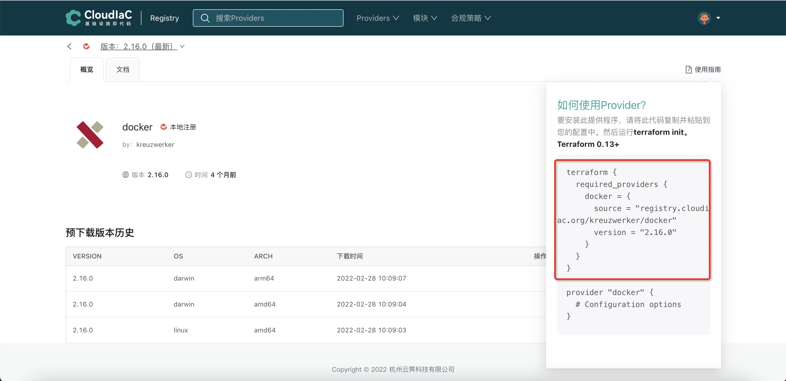
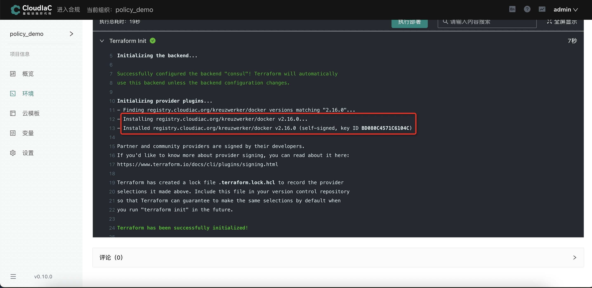

# 使用IaC Exchange的provider
## 场景描述

Terraform 提供了众多的 Providers 可以让我们对基础设施进行统一管理，但对于国内用户来说，在使用 Terraform 时体验可能并不友好，其中主要的原因可能就是下载 Provider 时各种超时问题导致的

由于 Terraform Provider 并没有国内源，所以下载 Provider 就成了耗时严重的环节，随便一个 Provder 动辄几分钟以上的下载时间，严重影响了我们的效率，更不要说一个完整的 Terraform 模板可能需要用到多个 Provider ，更甚的是经常因为下载时间太长出现 timeout 报错退出，导致根本用不起来。

针对上述问题，CloudIaC 推出 IaC Exchange，该IaC Exchange实现了Terraform的 provider registry协议以及 network mirror 协议，用户可以直接配置 network mirror，以代理的方式实现 provider 的缓存和下载，也可以提前在IaC Exchange网站上选择要使用的provider进行预下载，彻底解决国内 Terraform 用户因为网络原因导致的使用困难问题。
## 场景示例
下面以使用 IaC Exchange 中的docker provider作为示例说明

要使用本地发布到 IaC Exchange 中的 provider，只需要把 tf 文件中对应 provider 的参数 source 以及 version 的值改为对应的 IaC Exchange 存在的 provider 地址和版本即可，IaC Exchange 具体有哪些 provider 可查看[https://registry.cloudiac.org/provider](https://registry.cloudiac.org/provider)



示例仓库中 main.tf 中的文件内容如下：

```
terraform {
    required_providers {
      docker = {
        source = "registry.cloudiac.org/kreuzwerker/docker"
        version = "2.16.0"
      }
    }
  }

provider "docker" {}

resource "docker_image" "nginx" {
  name         = "nginx:latest"
  keep_locally = false
}

resource "docker_container" "nginx" {
  image = docker_image.nginx.latest
  name  = "tutorial"
  ports {
    internal = 80
    external = 8002
  }
}
```

### 效果展示

由此可见使用的正是 IaC Exchange 中的 provider 而非 terraform 官方的 provider ，并能达到官方 provider 的使用效果


