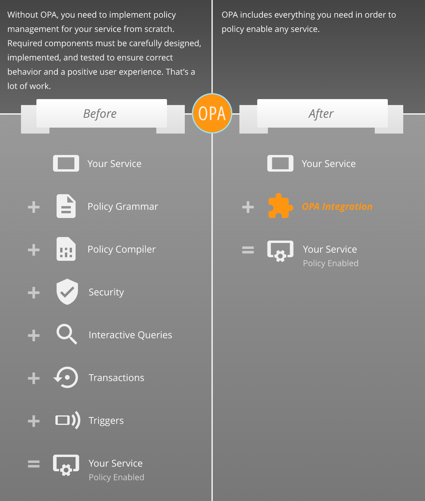

# 安全与合规

## 什么是合规

一旦配置了云基础设施，就必须对其进行持续监控，以防止引入风险的变化，并评估配置更改是否违反合规性和最佳安全实践。

在 CloudIaC 0.6 版本中，我们引入 OPA 来进行安全和合规检测。

合规作为 CloudIaC 的扩展功能，相对独立，不配置合规不影响平台的使用。合规功能目前只对**平台管理员**开放。平台管理员可以通过点击页面顶栏左侧的“进入合规”链接跳转到合规管理页面。

### OPA

[OPA（Open Policy Agent）](https://www.openpolicyagent.org/) 是一个开源的通用策略引擎，它可以统一整个应用的策略执行。

OPA 提供了一种高级声明性语言 Rego，可以让您将策略指定为代码和简单的 API，从而将策略的执行从应用中解耦。

{.img-fluid}

### Rego

OPA 策略以称为 Rego 的高级声明性语言表达，Rego 专门用于在复杂的分层数据结构上表达策略。

https://www.openpolicyagent.org/docs/latest/policy-language/

## 合规策略及策略组

合规策略即一条 Rego 语言描述的检测规则。创建策略时可以实时进行测试，调整输入和规则定义。

多个策略绑定到策略组，以组合实现复杂的合规规则。

*注意，当前版本中一个策略只能关联到一个策略组。*

## 应用合规策略

为了应用合规策略，我们需要将策略组绑定到环境或者Stack，并开启环境或Stack的合规检测功能。

开启合规检测的Stack会在每次编辑后自动执行合规检测。

开启合规检测的环境在部署时会自动执行合规策略的检测步骤，在部署日志中可查看合规策略执行的输出。若同时在环境设置中开启了 “合规不通过中止部署” 则在合规检测不通过时将中断部署，这样就能确保部署的环境符合合规要求。

除了自动触发检测步骤，我们也可以在合规管理页面或Stack和环境的管理页面手动发起合规检测。

## 屏蔽合规策略

为了实现灵活的策略组合配置，我们提供了策略屏蔽功能。

当希望某条策略在某个环境(或Stack)中不生效时，可以将策略在指定的环境(或Stack)上屏蔽，这样即使环境(或Stack)绑定了包含该策略的策略组，在执行检测时也不会应用该策略。

如果希望某条策略临时的在所有环境(或Stack)中不生效，则可以直接将该策略设置为屏蔽状态。

## 策略组的继承

每个环境都有一个关联的Stack，如果为Stack绑定了策略组则基于该Stack创建的环境会自动开启合规检测，并绑定Stack中使用的策略组，默认绑定的策略组可以手动移除。这样就允许您为Stack绑定一些基础合规规则，而环境的合规要求就可以再单独为环境配置。
